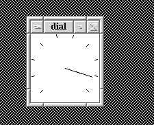

## XDial widget
This is a simple widget showing a gauge with a pointer
that can be moved (set to values) in some range min..max.

## What is this used for?
This is intended more or less to test X Windows code development on a
Sun Blade 100 historical workstation. Code is from around 1995,
slightly adjusted to OpenBSD 7.8 running on that machine. This 
machine runs X11R6.

## Build
I use ancient imake command for build setup.

Create Makefile:
```shell
-bash-5.3$ xmkmf
mv -f Makefile Makefile.bak
imake -DUseInstalled -I/usr/local/lib/X11/config
```

Create Library with single widget code:
```shell
-bash-5.3$ make
```

Create test program:
```shell
-bash-5.3$ make dial
```

## Run
```shell
-bash-5.3$ ./dial
```
result should look like this:



## Credits
The code is a small step away from some source code from the Young-book.

* *The X Window System : programming and applications with Xt*. Young, Douglas A., Online version,
  https://archive.org/details/xwindowsystempro0000youn